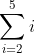
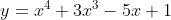
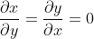

# Calculus

En este proyecto aprenderemos a conocer e identificar algunos conceptos de calculo, que es la notación de suma y producto, que es una serie, que es una derivada, que es la regla de producto, que es la regla de la cadena, las normas comunes sobre derivados, que es una derivada parcial, que es una integral indefinida, que es un integral definida, que es una integral doble

## Objetivos de aprendizaje
## General
* Summation and Product notation
* What is a series?
* Common series
* What is a derivative?
* What is the product rule?
* What is the chain rule?
* Common derivative rules
* What is a partial derivative?
* What is an indefinite integral?
* What is a definite integral?
* What is a double integral?

## Requerimientos
### Preguntas de respuesta múltiple
* Editores permitidos: vi, vim, emacs
* Escriba el número de la respuesta correcta en su archivo de respuestas
* Todos los archivos deben terminar con una nueva línea

Ejemplo

¿Que es 9 al cuadrado?
1. 99
2. 81
3. 3
4. 18
```
ubuntu@ubuntu$ cat answer_file
2
ubuntu@ubuntu$
```

## Task
### 0. Sigma is for Sum
()
1. 3 + 4 + 5
2. 3 + 4
3. 2 + 3 + 4 + 5 
4. 2 + 3 + 4

### 1. The Greeks pronounce it sEEgma
()
1. 90-20
2. 36i - 20
3. 90 - 8k
4. 36i - 8k

9i-2 + 9i-4 + 9i-6 + 9i-8

### 2. Pi is for Product

1. (m-1)!
2. 0
3. (m+1)!
4. m!

### 3. The Greeks pronounce it pEE

1. 10!
2. 9!
3. 100
4. 0

### 4. Hello, derivatives!

1. 
2. 
3. 
4. 

### 5. A log on the fire

1. 
2. 
3. 
4. 

### 6. It is difficult to free fools from the chains they revere

1. 
2. 
3. 
4. 

### 7. Partial truths are often more insidious than total falsehoods

1. 
2. 
3. 
4. 

### 8. Put it all together and what do you get?

1. 
2. 
3. 
4. 
